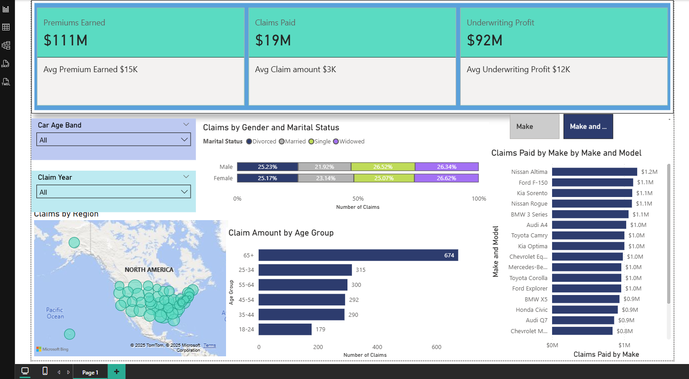

# 🚗 Car Insurance Dashboard – Power BI

This interactive Power BI dashboard explores a car insurance dataset to uncover insights on premiums, claims, customer demographics, and vehicle risks. It supports data-driven decisions in underwriting and risk management.

---

## 🛠 Tools
- Power BI Desktop (`.pbix`)
- DAX for KPIs and measures
- Slicers & filters (e.g., age group, year)
- Bing Maps for regional insights

---

## 📊 Dashboard Overview


Key metrics:
- **Premiums Earned:** $111M
- **Claims Paid:** $19M
- **Underwriting Profit:** $92M
- Avg Premium: $15K | Avg Claim: $3K | Avg Profit: $12K

---

## ✅ Insights
- Most claims from **65+** age group (~674 claims)
- **Nissan Altima** had highest claim payout ($1.2M)
- Urban regions drive more claims, but profits remain strong
- Claims distribution varies slightly by gender and marital status

---

## 📁 Structure
```
├── dashboard/
│   └── car_insurance_dashboard.pbix
├── data/
│   └── car_insurance_data.csv
├── image/
│   └── car_insurance_dashboard.png
└── README.md
```

---

